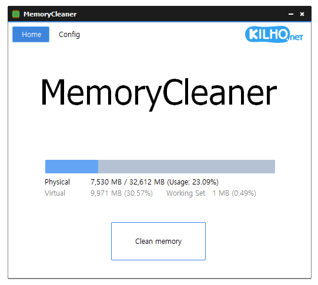

# MemoryCleaner

**ボタン 1 つでメモリを解放し、決めておいた条件で自動的にクリーンしてくれる、軽量な Windows 用の無料メモリクリーナー。**

[English](README.md) · [한국어](README.ko.md) · [简体中文](README.zh-CN.md) · 日本語 · [Español](README.es.md) · [Português (Brasil)](README.pt-BR.md) · [Français](README.fr.md)

> この文書は翻訳版です。内容に相違がある場合は[韓国語版](README.ko.md)が正となります。

-0078D4)

## 概要

MemoryCleaner は、今メモリがどれだけ使われているかを表示し、**メモリをクリーン** を 1 回押すだけで、Windows が抱えているキャッシュや、実行中のプログラムが今は使っていないメモリを取り戻すソフトです。

メモリ使用率が高くなったとき、決めた時間ごと、あるいはキャッシュがたまって空きメモリが足りなくなったときに、自動でクリーンするよう設定できます。ゲームや動画を全画面で使っている間はクリーンを見送るので、邪魔をしません。

ウィンドウを閉じると通知領域(タスクトレイ)に入り、静かに動き続けます。ウィンドウを閉じた後はウィンドウが使っていたメモリもすべて手放すので、タスクトレイで待機している間の MemoryCleaner 自身の使用量は 1 MB 程度です。

## 主な機能

- **ワンクリックでクリーン** — **メモリをクリーン** ボタンか、トレイアイコンのクリック 1 回でメモリをクリーンします。
- **クリーン対象の選択** — ファイルキャッシュ、ワーキングセット、スタンバイリスト、レジストリキャッシュ、メモリ結合など、クリーンする領域を自分で選べます。
- **自動クリーン** — 物理メモリ · 仮想メモリ · ワーキングセットの使用率が基準を超えたとき、または決めた時間ごとにクリーンします。
- **ゲームのカクつき防止** — キャッシュ(スタンバイリスト)がたまって空きメモリが足りなくなると、キャッシュだけを選んで解放します。
- **全画面の検出** — ゲーム・動画・プレゼンテーションを全画面で使っている間は自動クリーンを見送ります。
- **メモリ状態の表示** — 物理メモリ、仮想メモリ、ワーキングセット、キャッシュをホーム画面とトレイアイコンで確認できます。
- **軽い動作** — 実行ファイル 1 つだけで、タスクトレイで待機中は 1 MB 程度しか使いません。
- **9 言語** — 韓国語 · 英語 · 日本語 · 中国語 · ロシア語 · イタリア語 · フランス語 · スペイン語 · アラビア語。

## ダウンロード / インストール

| 種類 | リンク |
|---|---|
| インストーラー版 | [ダウンロード](https://down.kilho.net/memorycleaner?lang=ja) |
| ポータブル版 (ZIP) | [ダウンロード](https://down.kilho.net/memorycleaner?lang=ja&nosetup) |

インストーラー版はインストールが終わるとすぐに MemoryCleaner を起動し、**システム起動時に実行** をオンにするので、Windows にサインインするたびにタスクトレイで自動的に始まります。ポータブル版は ZIP を展開して `MemoryCleaner.exe` を実行するだけです。どちらも機能は同じです。

メモリのクリーンには管理者権限が必要なため、起動時に Windows が管理者権限の確認画面を表示します。**はい** を押してください。

## 使い方

### はじめての使い方

1. MemoryCleaner を起動し、管理者権限の確認画面で **はい** を押します。
2. **ホーム** に物理メモリの使用量がバーと数値で表示され、その下に仮想メモリ · ワーキングセット · キャッシュが表示されます。値は 1 秒ごとに更新されます。
3. **メモリをクリーン** を押すとボタンが **クリーニング中** に変わり、終わると使用量が減ったのをすぐに確認できます。
4. 自動でクリーンさせたいときは **設定** を押し、**自動クリーン** で使いたい条件をオンにします。
5. ウィンドウを閉じると、MemoryCleaner はタスクトレイに入って動き続けます。トレイアイコンを押すとウィンドウが再び開きます。

### 画面構成

**上部のボタン**

| 要素 | 役割 |
|---|---|
| **ホーム** | メモリの状態と **メモリをクリーン** ボタンがある最初の画面 |
| **設定** | 自動クリーン · クリーン対象 · 一般設定 |
| **寄付** | 寄付のページを開きます |
| KILHO.net ロゴ | MemoryCleaner の紹介ページを開きます |

**ホーム**

| 要素 | 内容 |
|---|---|
| バー | 物理メモリの使用率 |
| **物理** | 使用中 / 全体 (MB) と使用率 |
| **仮想** | ページファイルを含む仮想メモリの使用量と使用率 |
| **ワーキング** | 実行中のプログラムが占めているメモリと使用率 |
| **キャッシュ** | Windows がキャッシュとして抱えているメモリ(タスクマネージャーの「キャッシュ済み」と同じ値)と、物理メモリに対する割合 |
| **メモリをクリーン** | 今すぐクリーンします。クリーン中は **クリーニング中** に変わります |

**設定**

| グループ | 項目 |
|---|---|
| **自動クリーン** | **物理メモリ使用率(%)を超えるときにクリーン** · **ページファイル使用率(%)を超えるときにクリーン** · **ワーキングセット使用率(%)を超えるときにクリーン** · **次の時間(分)毎にクリーン** · **キャッシュ(スタンバイリスト)を解放 (ゲームのカクつき防止)** · **全画面表示中は整理しない** |
| **クリーン対象** | **ファイルキャッシュ** · **ワーキング** · **スタンバイリスト(低優先)** · **レジストリキャッシュ** · **メモリ結合** · **スタンバイリスト \*** · **変更ページリスト \*** |
| **一般設定** | **システム起動時に実行** · **トレイアイコンをクリックしてクリーン** |
| 下部 | 現在のバージョンと **初期値** ボタン |

**トレイアイコン**

| 操作 | 結果 |
|---|---|
| マウスを乗せる | 物理メモリ · 仮想メモリ · ワーキングセットの使用率 |
| 左クリック | ウィンドウを開く(**トレイアイコンをクリックしてクリーン** をオンにするとすぐにクリーン) |
| 右クリック | **メモリクリーナー**(ウィンドウを開く) · **作成者: オ・ギルホ**(紹介ページ) · **終了** |

クリーン中はトレイアイコンの形が変わるので、ウィンドウを開かなくてもクリーン中かどうかがわかります。

**クリーン対象** — それぞれ何を解放するか

| 項目 | 解放するもの | 初期 |
|---|---|---|
| **ファイルキャッシュ** | ファイルの読み書きのときに Windows がためたキャッシュ | オン |
| **ワーキング** | 実行中のプログラムが今は使っていないメモリ | オン |
| **スタンバイリスト(低優先)** | キャッシュのうち、再び使われる可能性が低いもの | オン |
| **レジストリキャッシュ** | レジストリを読むときにためたキャッシュ | オン |
| **メモリ結合** | 内容がまったく同じメモリを 1 つにまとめて空きを作る | オン |
| **スタンバイリスト \*** | キャッシュ全体 | オフ |
| **変更ページリスト \*** | ディスクへの書き込みを待っているメモリ | オフ |

`*` の付いた項目はゲームや動画の再生中に一瞬カクつくことがあるため、最初はオフになっています。

### こんなときは

**今すぐメモリをクリーンする**
**ホーム** の **メモリをクリーン** を押します。クリーン中はボタンが **クリーニング中** に変わり、終わると **メモリをクリーン** に戻ります。多くのプログラムを長く開いていて PC が重くなったときや、大きなゲームや編集ソフトを起動する直前に一度押すとよいでしょう。

**ウィンドウを開かずにトレイアイコンですぐクリーンする**
**設定 → トレイアイコンをクリックしてクリーン** をオンにすると、トレイアイコンを 1 回押すだけでクリーンされます。終わると「メモリを最適化しました。」という通知が出ます。この設定をオンにしている間は、トレイアイコンの右クリック → **メモリクリーナー** でウィンドウを開きます。

**ウィンドウなしでメモリの状態を確認する**
トレイアイコンにマウスを乗せると、物理メモリ · 仮想メモリ · ワーキングセットの使用率が表示されます。ウィンドウを開かなくても、今クリーンが必要かどうかの見当がつきます。

**メモリが足りなくなったら自動でクリーンする**
**設定 → 自動クリーン** で **物理メモリ使用率(%)を超えるときにクリーン** をオンにし、横の欄で基準(30 ~ 90%)を選びます。使用率が基準を超えると MemoryCleaner が自動でクリーンします。ページファイルまで多く使う環境なら **ページファイル使用率(%)を超えるときにクリーン** を、プログラムがメモリを多く占めることが問題なら **ワーキングセット使用率(%)を超えるときにクリーン** も一緒にオンにしてください。クリーンしても使用率が下がらないときは続けてクリーンせずに間隔をあけ、クリーンがかえって負担にならないようにします。

**一定の間隔でクリーンする**
**次の時間(分)毎にクリーン** をオンにして 5 · 10 · 20 · 30 · 40 · 50 · 60 分から選ぶと、使用率に関係なくその間隔ごとにクリーンします。つけっぱなしで長く使う PC をいつも軽く保ちたいときに便利です。

**ゲームを長く続けるとだんだん重くなるとき(キャッシュの解放)**
ゲームを起動している時間が長くなるほどカクつき、ゲームを再起動しないと直らないことがあります。Windows は一度読んだファイルをキャッシュ(スタンバイリスト)として抱えておきますが、これがたまって空きメモリが底をつくと、そのキャッシュを急いで取り戻すためにゲームが一瞬止まるからです。**キャッシュ(スタンバイリスト)を解放 (ゲームのカクつき防止)** をオンにすると、キャッシュが **キャッシュ(MB)が以上のとき解放** の基準(512 · 1024 · 2048 · 4096 MB)を超え、同時に空きメモリが **空きメモリ(MB)が未満のとき解放** の基準(1024 · 2048 · 4096 · 8192 · 16384 MB)より少なくなると、キャッシュだけを先に解放します。両方の条件がそろったときだけ動き、解放すると条件は自然に解けるので、必要なときにだけ働きます。

空きメモリの基準は、PC に搭載されたメモリの半分に合わせるのがおすすめです。

| 搭載メモリ | 空きメモリ(MB)が未満のとき解放 |
|---|---|
| 8 GB | 4096(初期値) |
| 16 GB | 8192 |
| 32 GB | 16384 |

ゲームのときだけオンにする必要はありません。タスクトレイで 1 MB 程度しか使わず、条件がそろったときだけ動くので、オンのままにしておけば大丈夫です。

**ゲームや映画の間は手を出さない**
**全画面表示中は整理しない** は最初からオンになっています。ゲーム、動画、プレゼンテーションを全画面で使っている間は自動クリーンを見送り、画面が一瞬止まるのを防ぎます。全画面を終えると、再びいつもどおりに動きます。

**クリーンする領域を自分で選ぶ**
**設定 → クリーン対象** でクリーンする領域にチェックを入れます。**メモリをクリーン** ボタンも自動クリーンも、この項目に従います。項目を 1 つもチェックしないとすることがないので、**メモリをクリーン** ボタンが淡色になります。

**もっと強力にクリーンしたいとき**
**スタンバイリスト \*** と **変更ページリスト \*** をオンにすると、キャッシュ全体と書き込み待ちのメモリまで解放し、空きメモリがいちばん増えます。ただしゲームや動画の再生中に一瞬カクつくことがあるので、必要なときだけオンにし、ふだんはオフにしておくのがおすすめです。

**「キャッシュ」の意味が知りたいとき**
**ホーム** の **キャッシュ** は、Windows が再び使うときに備えて抱えているメモリで、タスクマネージャーの「キャッシュ済み」と同じ値です。この値が大きいこと自体は悪くありませんが、ゲーム中にカクつくなら上のキャッシュの解放をオンにしてみてください。

**Windows の起動時に自動で始める**
**設定 → システム起動時に実行** をオンにすると、Windows にサインインして少しすると MemoryCleaner がタスクトレイで静かに始まります。管理者権限の確認画面も出ません。インストーラー版は最初からオンになっています。

**ウィンドウを閉じても動き続ける**
ウィンドウの X を押しても MemoryCleaner は終了せず、タスクトレイに入って自動クリーンを続けます。このときウィンドウが使っていたメモリもすべて手放すので、起動したままにしておいてもほとんど負担がありません。完全に終了するには、トレイアイコンの右クリック → **終了** を押して確認します。

**クリーン中に終了すると**
クリーンの途中で終了すると、ボタンが **クリーニング後に終了** に変わり、クリーンを終えてからプログラムが終了します。クリーンを途中で打ち切りません。

**すべての設定を最初の状態に戻す**
**設定** 下部の **初期値** を押して確認すると、自動クリーンとクリーン対象の設定がすべて初期値に戻ります。**システム起動時に実行** はそのままです。

**起動中なのにもう一度起動したとき**
MemoryCleaner は 1 つしか起動しません。タスクトレイにある状態でもう一度起動しても新しくは起動せず、すでに起動している MemoryCleaner のウィンドウが開きます。

## 設定

すべての設定は変更するとすぐに保存され、次回の起動でもそのまま使われます。

| 項目 | 初期値 |
|---|---|
| 物理メモリ · ページファイル · ワーキングセット使用率によるクリーン | オフ(オンにすると基準 90%) |
| 次の時間(分)毎にクリーン | オフ(オンにすると 30 分) |
| キャッシュ(スタンバイリスト)を解放 | オフ(オンにするとキャッシュ 1024 MB 以上 · 空きメモリ 4096 MB 未満) |
| 全画面表示中は整理しない | オン |
| クリーン対象 | ファイルキャッシュ · ワーキング · スタンバイリスト(低優先) · レジストリキャッシュ · メモリ結合 |
| システム起動時に実行 | インストーラー版はオン |
| トレイアイコンをクリックしてクリーン | オフ |
| 言語 | Windows の地域設定に従う(未対応の言語なら英語) |

## 動作環境

- Windows 10 · Windows 11(64 ビット)
- 管理者権限 — メモリのクリーンに必要です。起動時に確認画面が出ます(**システム起動時に実行** で始まるときは出ません)。
- 別途インストールするコンポーネントはありません。
- インターネット接続は新しいバージョンの案内にだけ使います。

## アップデート

MemoryCleaner は自動では更新 **しません**。起動時に新しいバージョンがあるか確認して案内ウィンドウを表示し、**[はい]** を押すとダウンロードページを開いてプログラムを閉じます。新しいバージョンは内部検証の後に手動で配布され、[MemoryCleaner のページ](https://kilho.net/memorycleaner)で告知されます。[アップデートポリシーのお知らせ](https://en.kilho.net/archives/notice/2940)を参照してください。

**バージョン履歴**

| バージョン | 日付 | 内容 |
|---|---|---|
| 3.0.0 | 2026-09-29 | 純粋な C で作り直し、より速く安定して — タスクトレイ待機時のメモリ 95% 以上、実行ファイルのサイズ約 98% 削減、クリーン対象の選択、キャッシュの自動解放(ゲームのカクつき防止)、ホームにキャッシュを表示、ゲーム・動画に合わせた初期クリーン設定、初期値に戻すボタン、アップデート確認と起動の安定性向上 |
| 2.0.3 | 2026-09-03 | ゲーム・動画の鑑賞を妨げないよう全画面の検出を向上、終了時の安定性強化、クリーン完了通知の正確さ向上、繰り返しクリーンの最適化、設定の安定性向上 |
| 2.0.2 | 2026-08-13 | 全画面の使用中はクリーンを見送るオプション、アンインストール時に自動起動の設定を整理、設定の読み込みと自動起動の安定性向上 |
| 2.0.1 | 2026-07-13 | ブラウザーのメモリクリーンを強化、長時間実行の安定性向上、通知と設定の安定性向上、スペイン語を追加 |

## ライセンス

MemoryCleaner は **フリーウェア** です。会社、自宅、官公庁、学校など、どこでも制限なく無料で使え、自由に再配布できます。

## リンク

- ウェブサイト: <https://kilho.net/memorycleaner>
- フォーラム: <https://kilho.top/forum/qna>
- X (Twitter): <https://www.twitter.com/kilhonet>

© KILHO.NET
