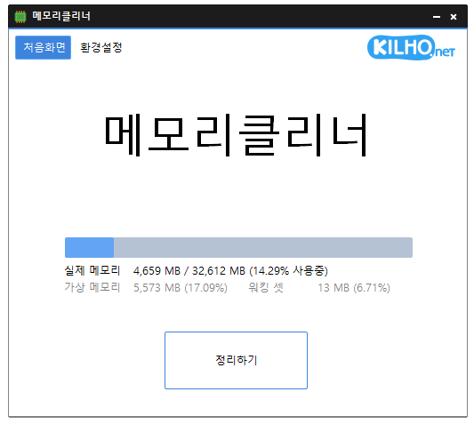

# 메모리클리너

**버튼 한 번으로 메모리를 정리하고, 정해 둔 조건에 맞춰 알아서 정리해 주는 가벼운 Windows 무료 메모리 정리 프로그램.**

[English](README.md) · 한국어 · [简体中文](README.zh-CN.md) · [日本語](README.ja.md) · [Español](README.es.md) · [Português (Brasil)](README.pt-BR.md) · [Français](README.fr.md)

-0078D4)

## 개요

메모리클리너는 지금 메모리가 얼마나 쓰이고 있는지 보여 주고, **정리하기** 한 번으로 Windows 가 붙잡고 있는 캐시와 프로그램들이 당장 쓰지 않는 메모리를 돌려받는 프로그램입니다.

메모리 사용률이 높아졌을 때, 정해 둔 시간마다, 또는 캐시가 쌓여 여유 메모리가 부족해졌을 때 알아서 정리하도록 맞춰 둘 수 있습니다. 게임이나 동영상을 전체 화면으로 보는 동안에는 정리를 건너뛰어 방해하지 않습니다.

창을 닫으면 작업 표시줄 알림 영역(트레이)으로 들어가 조용히 동작합니다. 창을 닫은 뒤에는 창이 쓰던 메모리까지 모두 내려놓아, 트레이에서 기다리는 동안 메모리클리너 자신은 1 MB 남짓만 씁니다.

## 주요 기능

- **한 번에 정리** — **정리하기** 버튼이나 트레이 아이콘 클릭 한 번으로 메모리를 정리합니다.
- **정리 항목 선택** — 파일 캐시, 워킹 셋, 스탠바이 목록, 레지스트리 캐시, 메모리 병합 등 정리할 영역을 직접 고릅니다.
- **자동 정리** — 실제 메모리 · 가상 메모리 · 워킹 셋 사용률이 기준을 넘을 때, 또는 정해 둔 시간마다 정리합니다.
- **게임 끊김 예방** — 캐시(스탠바이 목록)가 쌓이고 여유 메모리가 부족해지면 캐시만 골라 비웁니다.
- **전체 화면 감지** — 게임·동영상·프레젠테이션을 전체 화면으로 쓰는 동안에는 자동 정리를 건너뜁니다.
- **메모리 상태 표시** — 실제 메모리, 가상 메모리, 워킹 셋, 캐시됨을 첫 화면과 트레이 아이콘에서 확인합니다.
- **가벼운 실행** — 실행 파일 하나이고, 트레이에서 기다릴 때 1 MB 남짓만 씁니다.
- **9개 언어** — 한국어 · 영어 · 일본어 · 중국어 · 러시아어 · 이탈리아어 · 프랑스어 · 스페인어 · 아랍어.

## 다운로드 / 설치

| 종류 | 링크 |
|---|---|
| 설치판 | [다운로드](https://down.kilho.net/memorycleaner?lang=ko) |
| 무설치판 (ZIP) | [다운로드](https://down.kilho.net/memorycleaner?lang=ko&nosetup) |

설치판은 설치가 끝나면 메모리클리너를 바로 실행하고, **부팅시 실행하기** 를 켜 두어 Windows 에 로그인할 때마다 트레이에서 자동으로 시작합니다. 무설치판은 ZIP 을 풀고 `MemoryCleaner.exe` 를 실행하면 됩니다. 두 판의 기능은 같습니다.

메모리 정리에는 관리자 권한이 필요하므로, 실행할 때 Windows 가 관리자 권한 확인 창을 띄웁니다. **예** 를 누르면 됩니다.

## 사용법

### 처음 사용하기

1. 메모리클리너를 실행하고 관리자 권한 확인 창에서 **예** 를 누릅니다.
2. **처음화면** 에 실제 메모리 사용량이 막대와 숫자로 나오고, 그 아래에 가상 메모리 · 워킹 셋 · 캐시됨이 표시됩니다. 값은 1초마다 갱신됩니다.
3. **정리하기** 를 누르면 버튼이 **정리중** 으로 바뀌고, 정리가 끝나면 사용량이 줄어든 것을 바로 볼 수 있습니다.
4. 알아서 정리하게 하려면 **환경설정** 을 눌러 **자동 정리** 에서 원하는 조건을 켭니다.
5. 창을 닫으면 메모리클리너는 트레이로 들어가 계속 동작합니다. 트레이 아이콘을 누르면 창이 다시 열립니다.

### 화면 구성

**위쪽 버튼**

| 요소 | 역할 |
|---|---|
| **처음화면** | 메모리 상태와 **정리하기** 버튼이 있는 첫 화면 |
| **환경설정** | 자동 정리 · 정리 항목 · 기본 설정 |
| **후원하기** | 후원 페이지를 엽니다 |
| KILHO.net 로고 | 메모리클리너 소개 페이지를 엽니다 |

**처음화면**

| 요소 | 내용 |
|---|---|
| 막대 | 실제 메모리 사용률 |
| **실제 메모리** | 사용 중 / 전체 (MB) 와 사용률 |
| **가상 메모리** | 페이지 파일을 포함한 가상 메모리 사용량과 사용률 |
| **워킹 셋** | 실행 중인 프로그램들이 차지한 메모리와 사용률 |
| **캐시됨** | Windows 가 캐시로 붙잡아 둔 메모리(작업 관리자의 "캐시됨" 과 같은 값)와 실제 메모리 대비 비율 |
| **정리하기** | 지금 바로 정리합니다. 정리하는 동안에는 **정리중** 으로 바뀝니다 |

**환경설정**

| 묶음 | 항목 |
|---|---|
| **자동 정리** | **실제 메모리 사용률(%) 이상일 때 정리하기** · **가상 메모리 사용률(%) 이상일 때 정리하기** · **워킹셋 사용률(%) 이상일 때 정리하기** · **다음 시간(분) 마다 정리하기** · **캐시(스탠바이 목록) 비우기 (게임 끊김 예방)** · **전체화면인 경우 정리하지 않기** |
| **정리 항목** | **파일 캐시** · **워킹 셋** · **스탠바이 목록(저우선)** · **레지스트리 캐시** · **메모리 병합** · **스탠바이 목록 \*** · **수정된 페이지 목록 \*** |
| **기본 설정** | **부팅시 실행하기** · **트레이 아이콘 클릭시 정리하기** |
| 아래쪽 | 지금 버전과 **기본값** 버튼 |

**트레이 아이콘**

| 동작 | 결과 |
|---|---|
| 마우스를 올리기 | 실제 메모리 · 가상 메모리 · 워킹 셋 사용률 |
| 왼쪽 클릭 | 창 열기 (**트레이 아이콘 클릭시 정리하기** 를 켜면 바로 정리) |
| 오른쪽 클릭 | **메모리클리너**(창 열기) · **만든이 오길호**(소개 페이지) · **종료** |

정리하는 동안에는 트레이 아이콘 모양이 바뀌어, 창을 열지 않아도 정리 중인지 알 수 있습니다.

**정리 항목** — 무엇을 비우는지

| 항목 | 비우는 것 | 기본 |
|---|---|---|
| **파일 캐시** | 파일을 읽고 쓸 때 Windows 가 쌓아 둔 캐시 | 켬 |
| **워킹 셋** | 실행 중인 프로그램들이 당장 쓰지 않는 메모리 | 켬 |
| **스탠바이 목록(저우선)** | 캐시 가운데 다시 쓰일 가능성이 낮은 것 | 켬 |
| **레지스트리 캐시** | 레지스트리를 읽을 때 쌓아 둔 캐시 | 켬 |
| **메모리 병합** | 내용이 똑같은 메모리를 하나로 합쳐 공간을 확보 | 켬 |
| **스탠바이 목록 \*** | 캐시 전체 | 끔 |
| **수정된 페이지 목록 \*** | 디스크에 쓰려고 기다리는 메모리 | 끔 |

`*` 표시 항목은 게임이나 동영상 재생 중에 잠깐 멈칫하게 만들 수 있어 처음에는 꺼져 있습니다.

### 이럴 때 이렇게

**지금 바로 메모리를 정리**
**처음화면** 의 **정리하기** 를 누릅니다. 정리하는 동안 버튼이 **정리중** 으로 바뀌고, 끝나면 다시 **정리하기** 로 돌아옵니다. 여러 프로그램을 오래 켜 두었다가 컴퓨터가 무거워졌을 때, 큰 게임이나 편집 프로그램을 켜기 직전에 한 번 눌러 주면 좋습니다.

**창을 열지 않고 트레이 아이콘으로 바로 정리**
**환경설정 → 트레이 아이콘 클릭시 정리하기** 를 켜면, 트레이 아이콘을 한 번 누르는 것만으로 정리됩니다. 끝나면 "메모리를 정리하였습니다." 알림이 뜹니다. 이 설정을 켜 둔 동안 창은 트레이 아이콘 오른쪽 클릭 → **메모리클리너** 로 엽니다.

**메모리 상태를 창 없이 확인**
트레이 아이콘에 마우스를 올리면 실제 메모리 · 가상 메모리 · 워킹 셋 사용률이 표시됩니다. 창을 열지 않고도 지금 정리가 필요한지 가늠할 수 있습니다.

**메모리가 부족해지면 알아서 정리**
**환경설정 → 자동 정리** 에서 **실제 메모리 사용률(%) 이상일 때 정리하기** 를 켜고 옆 칸에서 기준(30 ~ 90%)을 고릅니다. 사용률이 기준을 넘으면 메모리클리너가 알아서 정리합니다. 페이지 파일까지 많이 쓰는 환경이라면 **가상 메모리 사용률(%) 이상일 때 정리하기** 를, 프로그램들이 메모리를 많이 차지하는 것이 문제라면 **워킹셋 사용률(%) 이상일 때 정리하기** 를 함께 켜세요. 정리해도 사용률이 내려가지 않을 때는 연달아 정리하지 않고 간격을 두어, 정리가 오히려 부담이 되지 않게 합니다.

**일정한 간격으로 정리**
**다음 시간(분) 마다 정리하기** 를 켜고 5 · 10 · 20 · 30 · 40 · 50 · 60분 중에 고르면, 사용률과 상관없이 그 간격마다 정리합니다. 켜 두고 오래 쓰는 PC 를 늘 가볍게 유지하고 싶을 때 좋습니다.

**게임을 오래 하면 점점 버벅일 때 (캐시 비우기)**
게임을 켜 둔 시간이 길어질수록 뚝뚝 끊기다가 게임을 껐다 켜야 풀리는 경우가 있습니다. Windows 는 한 번 읽은 파일을 캐시(스탠바이 목록)로 붙잡아 두는데, 이것이 쌓여 여유 메모리가 바닥나면 그 캐시를 급히 돌려받느라 게임이 순간적으로 끊기기 때문입니다. **캐시(스탠바이 목록) 비우기 (게임 끊김 예방)** 를 켜면, 캐시가 **캐시(MB) 이상일 때 비우기** 기준(512 · 1024 · 2048 · 4096 MB)을 넘고 동시에 여유 메모리가 **여유 메모리(MB) 미만일 때 비우기** 기준(1024 · 2048 · 4096 · 8192 · 16384 MB)보다 적어지면 캐시만 미리 비웁니다. 두 조건이 모두 맞을 때만 동작하고, 비운 뒤에는 조건이 저절로 풀리므로 필요한 순간에만 움직입니다.

여유 메모리 기준은 PC 에 설치된 메모리의 절반으로 맞추는 것이 좋습니다.

| 설치된 메모리 | 여유 메모리(MB) 미만일 때 비우기 |
|---|---|
| 8 GB | 4096 (기본값) |
| 16 GB | 8192 |
| 32 GB | 16384 |

게임할 때만 켤 필요는 없습니다. 트레이에서 1 MB 남짓만 쓰고 조건이 맞을 때만 움직이므로, 켜 둔 채로 두면 됩니다.

**게임이나 영화를 보는 동안에는 건드리지 않기**
**전체화면인 경우 정리하지 않기** 는 처음부터 켜져 있습니다. 게임, 동영상, 프레젠테이션을 전체 화면으로 쓰는 동안에는 자동 정리를 건너뛰어 화면이 멈칫하는 일을 막습니다. 전체 화면을 끝내면 다시 평소대로 동작합니다.

**정리할 영역을 직접 고르기**
**환경설정 → 정리 항목** 에서 정리할 영역을 체크합니다. **정리하기** 버튼과 자동 정리가 모두 이 항목을 따릅니다. 항목을 하나도 체크하지 않으면 할 일이 없으므로 **정리하기** 버튼이 흐려집니다.

**정리를 더 강하게 하고 싶을 때**
**스탠바이 목록 \*** 과 **수정된 페이지 목록 \*** 을 켜면 캐시 전체와 쓰기 대기 중인 메모리까지 비워 여유 메모리가 가장 많이 늘어납니다. 다만 게임이나 동영상 재생 중에 잠깐 멈칫할 수 있으니, 필요할 때만 켜고 평소에는 꺼 두는 것이 좋습니다.

**"캐시됨" 이 무슨 뜻인지 궁금할 때**
**처음화면** 의 **캐시됨** 은 Windows 가 다시 쓸 것에 대비해 붙잡아 둔 메모리로, 작업 관리자의 "캐시됨" 과 같은 값입니다. 이 값이 크다고 해서 나쁜 것은 아니지만, 게임 중 끊김이 있다면 위의 캐시 비우기를 켜 보세요.

**Windows 를 켤 때 자동으로 시작**
**환경설정 → 부팅시 실행하기** 를 켜면 Windows 에 로그인하고 잠시 뒤 메모리클리너가 트레이에서 조용히 시작합니다. 관리자 권한 확인 창도 뜨지 않습니다. 설치판은 처음부터 켜져 있습니다.

**창을 닫아도 계속 동작**
창의 X 를 누르면 메모리클리너는 끝나지 않고 트레이로 들어가 자동 정리를 계속합니다. 이때 창이 쓰던 메모리까지 모두 내려놓으므로, 켜 둔 채로 두어도 부담이 거의 없습니다. 완전히 끝내려면 트레이 아이콘 오른쪽 클릭 → **종료** 를 누르고 확인합니다.

**정리하는 도중에 종료하면**
정리가 진행 중일 때 종료하면 버튼이 **정리 후 종료** 로 바뀌고, 정리를 마친 뒤에 프로그램이 끝납니다. 정리를 중간에 끊지 않습니다.

**모든 설정을 처음 상태로**
**환경설정** 아래쪽의 **기본값** 을 누르고 확인하면 자동 정리와 정리 항목 설정이 모두 처음 값으로 돌아갑니다. **부팅시 실행하기** 는 그대로 둡니다.

**이미 실행 중인데 또 실행했을 때**
메모리클리너는 하나만 실행됩니다. 트레이에 있는 상태에서 다시 실행하면 새로 켜지지 않고, 이미 실행 중인 메모리클리너의 창이 열립니다.

## 설정

모든 설정은 바꾸는 즉시 저장되어 다음 실행에도 그대로 쓰입니다.

| 항목 | 기본값 |
|---|---|
| 실제 메모리 · 가상 메모리 · 워킹셋 사용률 기준 정리 | 끔 (켜면 기준 90%) |
| 다음 시간(분) 마다 정리하기 | 끔 (켜면 30분) |
| 캐시(스탠바이 목록) 비우기 | 끔 (켜면 캐시 1024 MB 이상 · 여유 메모리 4096 MB 미만) |
| 전체화면인 경우 정리하지 않기 | 켬 |
| 정리 항목 | 파일 캐시 · 워킹 셋 · 스탠바이 목록(저우선) · 레지스트리 캐시 · 메모리 병합 |
| 부팅시 실행하기 | 설치판은 켬 |
| 트레이 아이콘 클릭시 정리하기 | 끔 |
| 언어 | Windows 지역 설정을 따름 (지원하지 않는 언어면 영어) |

## 요구 사항

- Windows 10 · Windows 11 (64비트)
- 관리자 권한 — 메모리를 정리하려면 필요합니다. 실행할 때 확인 창이 뜹니다(**부팅시 실행하기** 로 시작할 때는 뜨지 않습니다).
- 따로 설치할 구성 요소는 없습니다.
- 인터넷 연결은 새 버전 안내에만 씁니다.

## 업데이트

메모리클리너는 자동으로 업데이트하지 **않습니다**. 실행할 때 새 버전이 있는지 확인해 안내 창을 띄우고, **[예]** 를 누르면 다운로드 페이지를 열고 프로그램을 닫습니다. 새 버전은 내부 검증 후 수동으로 배포되고 [메모리클리너 페이지](https://kilho.net/memorycleaner)에 공지됩니다. [업데이트 정책 안내](https://kilho.net/archives/notice/2940)를 참고하세요.

**버전 이력**

| 버전 | 날짜 | 내용 |
|---|---|---|
| 3.0.0 | 2026-09-29 | 순수 C 로 새로 만들어 더 빠르고 안정적으로 — 트레이 대기 메모리 95% 이상, 실행 파일 크기 약 98% 감소, 정리 항목 선택, 캐시 자동 비우기(게임 끊김 예방), 첫 화면에 캐시됨 표시, 게임·동영상에 맞춘 기본 정리 설정, 기본값 복원 버튼, 업데이트 확인과 실행 안정성 향상 |
| 2.0.3 | 2026-09-03 | 게임·영상 감상을 방해하지 않도록 전체 화면 감지 향상, 종료 안정성 강화, 정리 완료 알림 정확도 향상, 반복 정리 최적화, 설정 안정성 향상 |
| 2.0.2 | 2026-08-13 | 전체 화면 사용 중 정리 건너뛰기 옵션, 제거 시 자동 시작 설정 정리, 설정 불러오기와 자동 시작 안정성 향상 |
| 2.0.1 | 2026-07-13 | 브라우저 메모리 정리 강화, 장시간 실행 안정성 향상, 알림과 환경설정 안정성 향상, 스페인어 추가 |

## 라이선스

메모리클리너는 **프리웨어**입니다. 회사, 집, 관공서, 학교 등 어디서나 제약 없이 무료로 쓸 수 있고, 자유롭게 재배포할 수 있습니다.

## 링크

- 웹사이트: <https://kilho.net/memorycleaner>
- 포럼: <https://groups.google.com/g/kilhonet>
- X (Twitter): <https://www.twitter.com/kilhonet>

© KILHO.NET
